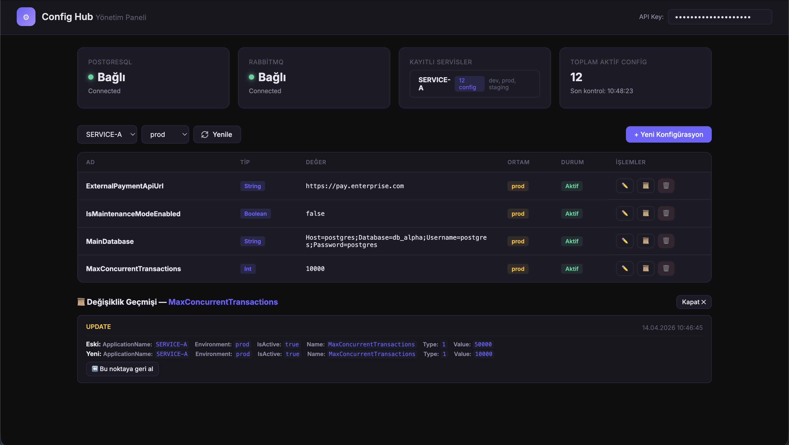
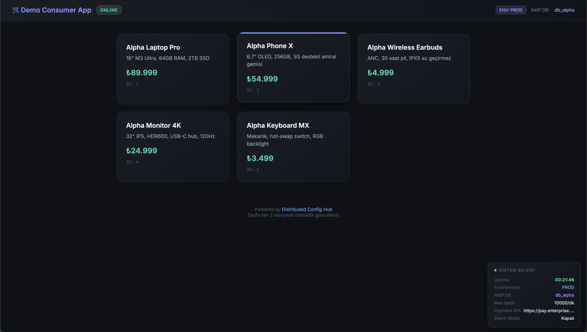
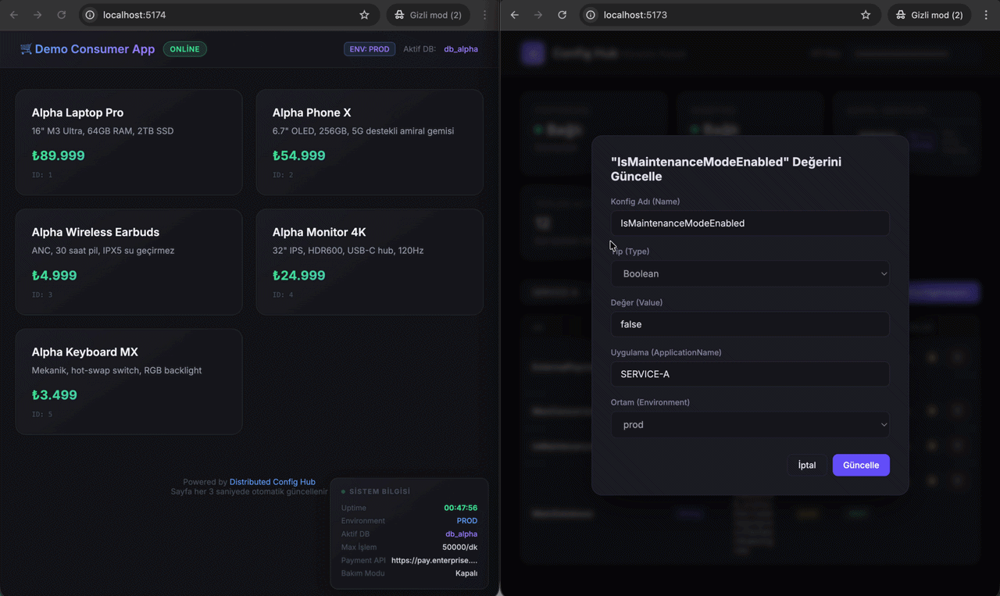
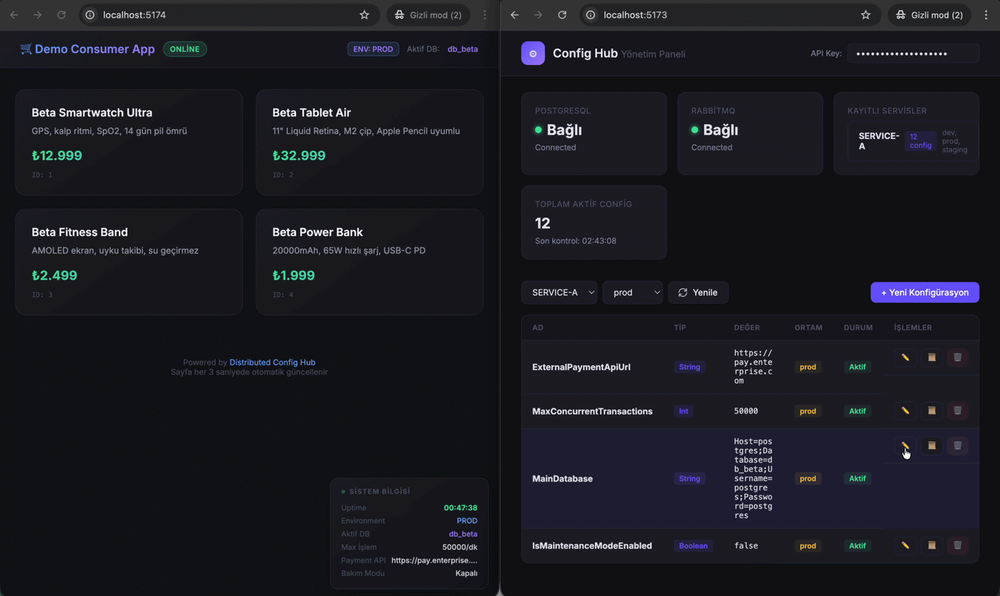

<p align="center">
  
  
  
  
  
  
  
</p>

# 🚀 DistributedConfigHub

A centralized, secure, and real-time (event-driven) configuration management system. This project enables configuration changes in microservice architectures to be managed safely and in isolation without requiring service restarts (zero-downtime).

> **Starts with a single command:** `docker compose up --build -d`

---

## 🛠️ Key Features
- [x] **Message Broker:** Low network overhead using RabbitMQ Direct Exchange.
- [x] **Environment Support:** Environment-based (Dev, Staging, Prod) record management.
- [x] **Audit & Rollback:** Complete history of all changes with one-click rollback.
- [x] **Docker Compose:** Spin up the entire ecosystem (DB, MQ, API, Consumer) with a single command.
- [x] **Zero Downtime:** Update configurations without restarting services.

---

## 📐 Architecture (Clean Architecture + CQRS)

```text
┌────────────────────────────────────────────────────────────────────┐
│                🌐 🌐 🌐 Admin Panel (SPA) 🌐 🌐 🌐                   │
│                      http://localhost:5173                         │
└────────────────────────────┬───────────────────────────────────────┘
                             │ REST API
┌────────────────────────────▼───────────────────────────────────────┐
│                 DistributedConfigHub.Api                           │
│  ┌────────────┐    ┌──────────────┐    ┌─────────────────────────┐ │
│  │ Controllers│    │ Action Filter│    │ Exception Handlers      │ │
│  │            │    │ (ApiKey Auth)│    │ (Validation + Global)   │ │
│  └─────┬──────┘    └──────────────┘    └─────────────────────────┘ │
│        │ MediatR (CQRS)                                            │
│  ┌─────▼──────────────────────────────────────────────────────┐    │
│  │              DistributedConfigHub.Application              │    │
│  │    Commands: Create, Update, Delete, Rollback              │    │
│  │    Queries:  GetAll, GetById, GetHistory                   │    │
│  │    Behaviors: ValidationBehavior (Pipeline)                │    │
│  └─────┬──────────────────────────────────────────────────────┘    │
│        │                                                           │
│  ┌─────▼──────────────────────────────────────────────────────┐    │
│  │             DistributedConfigHub.Infrastructure            │    │
│  │   EF Core + PG │ RabbitMQ Publisher │ AuditInterceptor     │    │
│  └─────┬────────────────────────┬─────────────────────────────┘    │
└────────┼────────────────────────┼──────────────────────────────────┘
         │                        │
    ┌────▼─────┐            ┌─────▼──────┐
    │ 🐘 PG 🐘  │            │ 🐇 RabbitMQ│
    │  :5432   │            │    :5672   │
    └──────────┘            └─────┬──────┘
                                  │ Signal (Direct Exchange)
                           ┌──────▼──────────────────────────┐
                           │      DemoConsumerApp            │
                           │  ┌──────────────────────────┐   │
                           │  │      Client (SDK)        │   │
                           │  │  • RabbitMqSubscriber    │   │
                           │  │  • Hot-Reload Cache      │   │
                           │  │  • Fallback (JSON file)  │   │
                           │  └──────────────────────────┘   │
                           └─────────────────────────────────┘
```


### Project Layers

| Layer | Responsibility |
|---|---|
| **Domain** | Entities (`ConfigurationRecord`, `AuditLog`), Enums, `BaseAuditableEntity` |
| **Application** | CQRS Command/Queries, Validators, Interfaces, DTOs |
| **Infrastructure** | EF Core DbContext, Repositories, RabbitMQ Publisher, Audit Interceptor |
| **Api** | Controllers, Action Filter (API Key), Exception Handlers, Admin Panel |
| **Client (SDK)** | NuGet-ready library for consumers: config cache, RabbitMQ subscriber, fallback |
| **DemoConsumerApp** | Example service using the SDK: live update demo |
| **Tests** | Unit + Integration tests (xUnit, Testcontainers) |

---

### 📁 Folder Structure

```text
DistributedConfigHub.Net/
├── 📦 DistributedConfigHub.Api/           # REST API + Admin Panel
│   ├── Controllers/                       # Configurations, Health
│   ├── Filters/                           # ApiKeyAuthorizeAttribute (X-Api-Key Security)
│   ├── Infrastructure/ExceptionHandling/  # GlobalExceptionHandler
│   └── wwwroot/                           # Admin Panel (Pure JS/CSS Login & Dashboard)
│
├── 📦 DistributedConfigHub.Application/   # CQRS + Business Logic
│   ├── Features/Commands/                 # Create, Update, Delete, Rollback Handlers
│   ├── Features/Queries/                  # GetList, GetById, GetDeleted, GetHistory Handlers
│   ├── Behaviors/                         # Validation & TenantAuthorization (Pipeline)
│   ├── Exceptions/                        # Custom Application Exceptions
│   ├── DTOs/                              # Data Transfer Objects (ConfigurationDto)
│   └── Interfaces/                        # Repository, Messaging and Context Contracts
│
├── 📦 DistributedConfigHub.Domain/        # Domain Model (Zero Dependency)
│   ├── Entities/                          # ConfigurationRecord, AuditLog, BaseAuditableEntity
│   └── Enums/                             # ConfigurationType (Numeric/JSON/Bool/etc)
│
├── 📦 DistributedConfigHub.Infrastructure/# Infrastructure and Data Access
│   ├── Data/                              # ConfigDbContext, FluentAPI Configs, Interceptors
│   ├── Migrations/                        # PostgreSQL Database Schemas
│   ├── Repositories/                      # EF Core Repository Implementations
│   └── Messaging/                         # RabbitMqPublisher (Signaling Logic)
│
├── 📦 DistributedConfigHub.Client/        # Smart SDK (Consumer-Side)
│   ├── Interfaces/                        # IConfigSdkService (Contracts)
│   ├── Models/                            # DTOs and Settings (Item, Options)
│   ├── Services/                          # Application Logic (SDK, Subscriber)
│   └── ServiceCollectionExtensions.cs     # DI Registration Mechanism
│
├── 📦 DemoConsumerApp/                    # "Zero Downtime" Example Application
│   ├── Controllers/                       # ServiceHealth (DB & SDK Health Check)
│   ├── Data/                              # ProductDbContext & DatabaseInitializer
│   └── local-fallback-config.json         # Backup Configuration used when API is down
│
├── 📦 DistributedConfigHub.Tests/         # Test Processes
│   ├── DistributedConfigHub.UnitTests     # Moq-Based Logic Tests
│   └── DistributedConfigHub.IntegrationTests # Testcontainers (Docker) Based End-to-End Tests
│
├── 📂 docs/                               # Documentation Assets
│   ├── ConfigHub.postman_collection.json  # Up-to-date Postman Collection
│   └── assets/                            # Demo GIF and Screenshots
│
├── 🐳 docker-compose.yml                  # Full-stack Orchestration
└── 📄 README.md

```
---

## 🏗️ Architectural Choices and Technical Justifications

### 1. Storage: Why PostgreSQL? (Relational vs. NoSQL)
In this project, configuration is not just a "Key-Value" pair; it includes metadata like ownership, environment, and active status.
- **Data Integrity (ACID):** Using a **Composite Unique Constraint** on `Name + ApplicationName + Environment`, inconsistent data entry is prevented at the database level.
- **Audit Trail:** A relational structure was chosen to provide "Rollback" and "History" features. With the `EF Core Interceptor` architecture, every change is automatically recorded in the `AuditLog` table.
- **Persistence:** Redis is a caching solution; since configuration is the "brain" of the system, PostgreSQL was chosen for its persistence and relational querying capabilities.

### 2. Live Updates: Why RabbitMQ? (Event-Driven)
**RabbitMQ (Direct Exchange)** was chosen to instantly reflect changes.
- **Guaranteed Delivery:** Unlike Redis Pub/Sub, RabbitMQ ensures the message is delivered (Queue structure).
- **Targeted Routing (RoutingKey):** Each application uses its own `ApplicationName` as a `RoutingKey`. Thus, when `SERVICE-A` is updated, `SERVICE-B` is not subjected to unnecessary network traffic or CPU load.
- **Instant Synchronization:** The moment a change is made, consumer SDKs are notified and they update their memory (cache) in under 10ms.

### 3. Application Isolation (Multi-Layered Security)
The system implements a "Zero Trust" principle:
- **Identification (Filter):** The identity of the requester is verified via API Key using the `ApiKeyAuthorizeAttribute`.
- **Authorization (MediatR Pipeline):** Using `TenantAuthorizationBehavior`, an attempt by one service to access another service's data is blocked using a **"Zero-Database-Trip"** method before it even reaches the business logic (Handler).
- **Double-Trip Protection:** To prevent performance loss in ID-based requests (Update/Delete), authorization is performed at the Handler level, avoiding the Double-Trip Anti-pattern.

### 4. Resilience — Last Known Good Configuration (LKGC)
A multi-layered protection strategy against the "Single Point of Failure" (SPOF) risk of centralized systems is implemented:
- **3-Tier Retry:** When the SDK cannot reach the API, it doesn't give up immediately; it retries 3 times with exponential backoff.
- **Memory-over-Disk Priority:** In the event of an API error or database outage, if there is already working data in the SDK's memory, it is **never deleted/corrupted.** The "Graceful Stay" principle (Old but working data is better than none) applies.
- **Empty Response Guard:** Even if the API returns 200 OK, if it sends an "empty" list because the database connection is lost; the SDK considers this data "suspicious" and preserves its existing healthy cache.
- **Local Snapshot & Graceful Degradation:** The asynchronous backup on disk (`local-fallback-config.json`) only kicks in if the API is down during the initial startup. Thus, even if the center crashes, the client can boot up with the "Last Known Good" values.

> [!NOTE]
> **Cache Hierarchy:** The SDK uses a "RAM > Disk" hierarchy for performance. If data is in RAM while the API is down, it does not go to disk (avoiding Disk I/O cost). Disk snapshots are just an insurance for "Cold Start" scenarios where memory is empty (e.g., the central API crashes at 03:00 AM, and the consumer app restarts at that exact moment).

### 5. Structural Design: Why Clean Architecture & CQRS?
Clean Architecture is adopted to ensure system sustainability, growth potential, and testability, keeping business rules at the center and dependencies flowing inwards.
- **Separation of Concerns:** `Domain` and `Application` layers are completely agnostic of infrastructure tools (EF Core, RabbitMQ, HTTP). Thus, even if you switch to another database tomorrow, not a single line of code in the business logic changes.
- **Focused Business Logic (CQRS):** Read (Query) and write (Command) operations are separated using `MediatR`. This approach ensures that classes (Handlers) serve only a single purpose (Single Responsibility) and prevents spaghetti code.
- **High Testability:** Since the business logic is not tightly-coupled to the database or network infrastructure, writing Unit Tests by `Mock`ing external services is extremely fast and reliable.

### 6. Memory Management: Why ConcurrentDictionary & Volatile? (High-Performance Caching)
A "Lock-Free Read" principle is implemented while holding configurations in memory within the SDK:
- **ConcurrentDictionary:** Allows thousands of threads to read data from the dictionary simultaneously without blocking the write (update) operation.
- **Volatile & Atomic Swap:** The `_cache` reference is marked as `volatile`. When new configurations arrive from the API, instead of modifying the old dictionary, a completely new dictionary is created and the reference is swapped **atomically**. This ensures reader threads never see "partially filled" or "corrupt" data.
- **SemaphoreSlim:** Used to prevent the system from sending unnecessary multiple API requests during a configuration refresh (`Reload`). Reads are lock-free, but writes (the moment of update) are serially controlled.


---

## 🔩 Dependency Injection — Service Scope Decisions

### API Side (`Program.cs`)

| Service | Scope | Reason |
|---|---|---|
| `ConfigDbContext` | **Scoped** | EF Core DbContext requires a per-request lifecycle |
| `IConfigurationRepository` | **Scoped** | Dependent on DbContext, must be in the same scope |
| `IAuditLogRepository` | **Scoped** | Dependent on DbContext |
| `IMessagePublisher` (RabbitMQ) | **Singleton** | Persistent connection/channel reuse, thread-safe with `SemaphoreSlim` |
| `IAuditContextAccessor` | **Singleton** | Carries data on a per-request basis with `AsyncLocal<T>`, stateless |
| `AuditInterceptor` | **Singleton** | EF Core interceptors run as singletons |
| `ApiKeyAuthorizeAttribute` | **Scoped** | New instance per request as a `ServiceFilter` |

### SDK (Client) Side (`ServiceCollectionExtensions.cs`)

| Service | Scope | Reason |
|---|---|---|
| `IConfigSdkService` | **Singleton** | `ConcurrentDictionary` cache must be preserved throughout the lifecycle |
| `HttpClient` | **IHttpClientFactory** | DNS pool management, prevents socket exhaustion with `SetHandlerLifetime(5min)` |
| `RabbitMqSubscriberHostedService` | **Singleton** | `BackgroundService` is already a Singleton |

> **⚠️ Captive Dependency Warning:** `IConfigSdkService` must be a Singleton because the `BackgroundService` (Singleton) injects it. Making it Transient/Scoped causes a Captive Dependency anti-pattern.

---

## 🛠️ Setup & Execution

### Requirements
- [Docker Desktop](https://www.docker.com/products/docker-desktop/) (v20+ recommended)
- Git

### Run with a Single Command

```bash
# 1. Clone the project
git clone https://github.com/FurkanHaydari/DistributedConfigHub.Net
cd DistributedConfigHub.Net

# 2. Spin up the entire system
docker compose up --build -d

# 3. Check container statuses
docker compose ps
```

> ⏳ The initial `--build` takes about 30-60 seconds. The API starts after PostgreSQL and RabbitMQ health checks pass.

### Clean Start (Volume Reset)

To recreate the database from scratch:

```bash
docker compose down -v        # Delete volumes
docker compose up --build -d  # Recreate
```

---

## 🌐 Ports & Access Information

When the system is up, the following addresses become active:

| Service | URL | Description |
|---|---|---|
| 🖥️ **Admin Panel** | http://localhost:5173 | Management interface (config CRUD, health, audit) |
| 📡 **Scalar UI (API)** | http://localhost:5173/scalar/v1 | Admin API modern endpoint documentation |
| ❤️ **Health Check** | http://localhost:5173/Health | PostgreSQL + RabbitMQ status check |
| 🖥️ **Demo Consumer App** | http://localhost:5174 | Consumer App Service|
| 📡 **Swagger UI** | http://localhost:5174/swagger | Demo Consumer App API endpoint documentation |
| 🐇 **RabbitMQ Panel** | http://localhost:15672 | Queue management (`guest` / `guest`) |
| 🐘 **PostgreSQL** | localhost:5432 | Database (`postgres` / `postgres`) |

### 🔑 API Key Information

| Application | API Key | Usage |
|---|---|---|
| `SERVICE-A` | `service-a-secret-key` | Service A Key |
| `SERVICE-B` | `service-b-secret-key` | Service B Key |

---

## 📡 API Endpoints

| Method | Endpoint | Description |
|---|---|---|
| `GET` | `/configurations?applicationName=SERVICE-A` | List configurations |
| `GET` | `/configurations/{id}` | Get single configuration |
| `POST` | `/configurations` | Create new configuration |
| `GET` | `/configurations/deleted?applicationName=SERVICE-A` | List deleted (IsActive = false) configurations |
| `PUT` | `/configurations/{id}` | Update value (+ RabbitMQ signal) |
| `DELETE` | `/configurations/{id}` | Deactivate configuration |
| `GET` | `/configurations/{id}/history` | View audit history |
| `POST` | `/configurations/{id}/rollback/{auditLogId}` | Rollback to a specific point |
| `GET` | `/Health` | PostgreSQL + RabbitMQ status check |


### 📬 Quick Testing with Postman Collection

To quickly explore and test the API after spinning up the project, there is a ready-to-use Postman configuration in the repository.

**How to Use?**
1. Open the Postman application and click the **Import** button at the top left.
2. Select and import the `ConfigHub.postman_collection.json` file located under the `docs` folder in the project directory.
3. All requests in the imported folder come ready with environment variables (e.g., `X-Api-Key`, `url`, `configId`, `auditLogId`) and some scripts.
4. You can start testing the API directly by clicking the **Send** button without making any settings!

### Example Requests

**List Configurations:**
```http
GET /configurations?applicationName=SERVICE-A
X-Api-Key: service-a-secret-key
```

**Add New Configuration:**
```http
POST /configurations
Content-Type: application/json
X-Api-Key: service-a-secret-key

{
  "name": "NewFeatureFlag",
  "type": 0,
  "value": "enabled",
  "applicationName": "SERVICE-A",
  "environment": "prod"
}
```


**Update Value (Live Signal):**
```http
PUT /configurations/00000000-0000-0000-0000-000000000001
Content-Type: application/json
X-Api-Key: service-a-secret-key

{
  "id": "00000000-0000-0000-0000-000000000009",
  "value": "true"
}
```

---

## 🧪 Tests

```bash
# Run all tests
dotnet test

# Result: 17/17 Test Passed ✅
```

| Test Category / Class | Scope |
|---|---|
| **🧪 Unit Tests** | |
| `ConfigSdkServiceTests` | All kinds of network outage scenarios on the SDK side, local file (fallback) mechanism, and relative URL resolution. |
| `UpdateConfigurationCommandHandlerTests` | MediatR command processing, `KeyNotFoundException` thrown for missing records, and asynchronous RabbitMQ event triggering. |
| `ApiKeyAuthorizeAttributeTests` | `X-Api-Key` validation logic, `401 Unauthorized` responses for missing/incorrect keys, and security filters. |
| **🔗 Integration Tests** | |
| `LiveUpdateIntegrationTest` | Live signaling and data consistency test on a real RabbitMQ and PostgreSQL (Testcontainers). |
| `RollbackIntegrationTest` | Rollback flow to restore a configuration to an old point with millisecond accuracy via audit logs. |
| `SecurityAndResilienceIntegrationTest`| End-to-end verification of resilience scenarios at the infrastructure layer and API security. |


---

## 🎯 Demo Scenario

You can experience the system **live** by following the steps below in order.

### Preparation — Window Layout

Before starting the live test, prepare the following windows:

| Window | Content | Note |
|---|---|---|
| 🖥️ Terminal 1 | Docker commands | Main terminal |
| 🖥️ Terminal 2 | `docker compose logs -f demo_consumer` | Consumer logs (live) |
| 🖥️ Terminal 3 | `docker compose logs -f config_api` | Config Hub logs (live) |
| 🌐 Browser Tab 1 | `http://localhost:5173` | Admin Panel |
| 🌐 Browser Tab 2 | `http://localhost:5174` | Consumer Product Page |
| 🌐 Browser Tab 3 | `http://localhost:15672` | RabbitMQ (optional) |

---

### Phase 1 — Spinning Up the System

In **Terminal 1**:
```bash
docker compose up --build -d
docker compose ps   # All 4 containers should be "Up"
```

Open **Terminal 2** and **Terminal 3** (side by side):
```bash
# Terminal 2 — Watch consumer logs live
docker compose logs -f demo_consumer

# Terminal 3 — Watch Config Hub API logs live
docker compose logs -f config_api
```

> 💡 Initially, the following logs will appear in Terminal 2:
> ```
> Database 'db_alpha' created on PostgreSQL server.
> Database 'db_alpha' initialized with seed data.
> Database 'db_beta' created on PostgreSQL server.
> Database 'db_beta' initialized with seed data.
> RabbitMQ Background Subscriber initialized and listening to routing key: SERVICE-A
> ```
> Both databases are created by the `DatabaseInitializer`.

---

### Phase 2 — Admin Panel Overview



🌐 **Browser Tab 1** → `http://localhost:5173`

1. **Health cards** show the health status → PostgreSQL ✅, RabbitMQ ✅
2. **Registered Services** card shows registered services → SERVICE-A (dev, staging, prod)
3. You can switch between environments using the filter → dev / staging / prod
4. You can examine records like `MainDatabase`, `IsMaintenanceModeEnabled`, `ExternalPaymentApiUrl` in the configuration list.

---

### Phase 3 — Consumer Product Page



🌐 **Browser Tab 2** → `http://localhost:5174`

1. The page will automatically load products (5 Alpha products)
2. **"SYSTEM INFO" panel in the bottom right corner** can be seen:
   - **Uptime** → How long the application has been up (this value will keep increasing!)
   - **Environment** → PROD (automatically from `ASPNETCORE_ENVIRONMENT`)
   - **Active DB** → db_alpha
   - **Maintenance Mode** → Disabled
3. **ENV: PROD** and **Active DB: db_alpha** badges appear in the header

> 💡 The page auto-refreshes every 3 seconds — no manual refresh required.

---

### Phase 4 — Maintenance Mode Demo (Live Config Change)



🌐 **Browser Tab 1** → Admin Panel

1. Update the `IsMaintenanceModeEnabled` (dev) value from `false` → `true` and save

🌐 **Browser Tab 2** → Consumer Page (Auto-refreshes every 3 seconds)

2. The maintenance mode overlay will appear **instantly**:
   - 🔧 Special maintenance mode window
   - **Environment: DEV · DB: db_alpha** info

3. **SYSTEM INFO panel** continues to appear in maintenance mode:
   - Maintenance Mode → **ACTIVE** (yellow)
   - Uptime → Still increasing (application does not restart)

4. Return to Admin Panel and set `IsMaintenanceModeEnabled` → `false`
5. The consumer page **instantly** returns to the product catalog ✨

---

### Phase 5 — Database Hot-Swap (Magic Moment ✨)



🌐 **Browser Tab 2** → Look at the products on the Consumer page and the panel on the bottom right:
- 5 **Alpha** products (Alpha Laptop Pro, Alpha Phone X, ...)
- Active DB: **db_alpha**
- Pay attention to the Uptime value

🌐 **Browser Tab 1** → Return to Admin Panel:

1. Find the `MainDatabase` (dev) configuration
2. Change its value:
   ```
   Old: Host=postgres;Database=db_alpha;Username=postgres;Password=postgres
   New: Host=postgres;Database=db_beta;Username=postgres;Password=postgres
   ```
3. Save

🌐 **Browser Tab 2** → Return to Consumer page:

4. Now **4 Beta products** are visible! (Beta Smartwatch Ultra, Beta Tablet Air, ...)
5. In the bottom right panel:
   - Active DB → **db_beta** 🟣
   - Uptime → **Still increasing!** Application did not close 🟢
   - Maintenance Mode → Disabled

---

### Phase 6 — Audit & Rollback


🌐 **Browser Tab 1** → Admin Panel

1. Click the **📜 (history)** button of the `MainDatabase` configuration
2. Change history will be visible (INSERT → UPDATE → ...)
3. Rollback to the first value (db_alpha) with the **"Rollback to this point"** button
4. **Alpha products** will appear again on the Consumer page
5. Uptime **still** continues 🟢

---

### Phase 7 — RabbitMQ Visualization (Optional)

🌐 **Browser Tab 3** → `http://localhost:15672` → Login: `guest` / `guest`

1. **Examining Exchange Structure:**
   - Go to the **Exchanges** tab and click on the `config_updates_direct` exchange.
   - In the **Bindings** section, you will see the currently connected `demo_consumer` queue and `SERVICE-A` routing key.

2. **"Sniffing" with a New Queue (Security Test):**
   - Since real consumers use `Exclusive` queues (which are deleted when the connection drops), they are hard to monitor externally. Go to the **Queues and Streams** tab for this.
   - Create a persistent queue named `debug-sniffer` from the **Add a new queue** section.
   - Enter this new queue and bind it to the `config_updates_direct` exchange with the `SERVICE-A` routing key from the **Bindings** section.

3. **Capturing Message Live:**
   - Update a setting from the Admin Panel.
   - You will see the message drop into the `debug-sniffer` queue in RabbitMQ (`Ready: 1`).
   - Click the **Get Messages** button in the queue details. 
   - ✨ The payload of the signal (e.g. `{"SERVICE-A|prod"}`) will appear as raw data.

---

### Phase 8 — Security Demo (Optional)

Send a request with an incorrect API key:
```bash
curl -H "X-Api-Key: wrong-key" "http://localhost:5173/configurations?applicationName=SERVICE-A"
# → 401 Unauthorized
```

With the correct API key:
```bash
curl -H "X-Api-Key: service-a-secret-key" "http://localhost:5173/configurations?applicationName=SERVICE-A"
# → 200 OK + JSON data
```

---

### 📋 Quick Reference — Docker Log Commands

<details>
<summary><b>Click to See Log Commands</b></summary>
<br>

```bash
# All container logs (live)
docker compose logs -f

# Only Consumer logs
docker compose logs -f demo_consumer

# Only Config Hub API logs
docker compose logs -f config_api

# Only PostgreSQL logs
docker compose logs -f postgres

# Only RabbitMQ logs
docker compose logs -f rabbitmq

# Last 50 lines + live tracking
docker compose logs -f --tail=50 demo_consumer

# Container statuses
docker compose ps
```
</details>

---

<p align="center">
  💻 Developed by <b>Furkan Haydari</b>. <br><br>
  <a href="https://github.com/FurkanHaydari"></a>
  <a href="https://www.linkedin.com/in/furkanhaydari"></a>
  <a href="mailto:nomorerotting@gmail.com"></a>
</p>